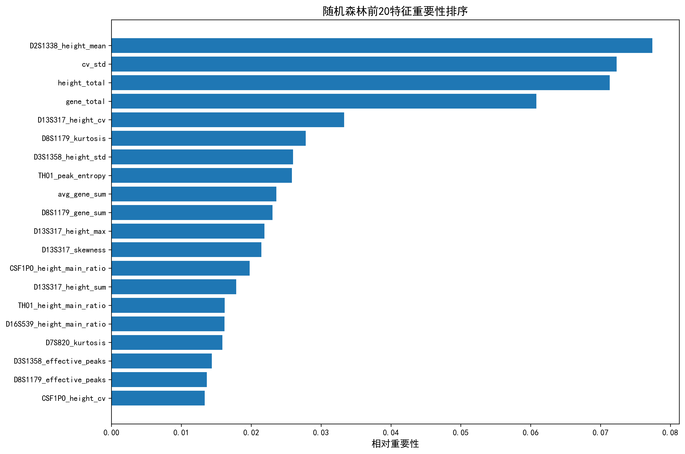
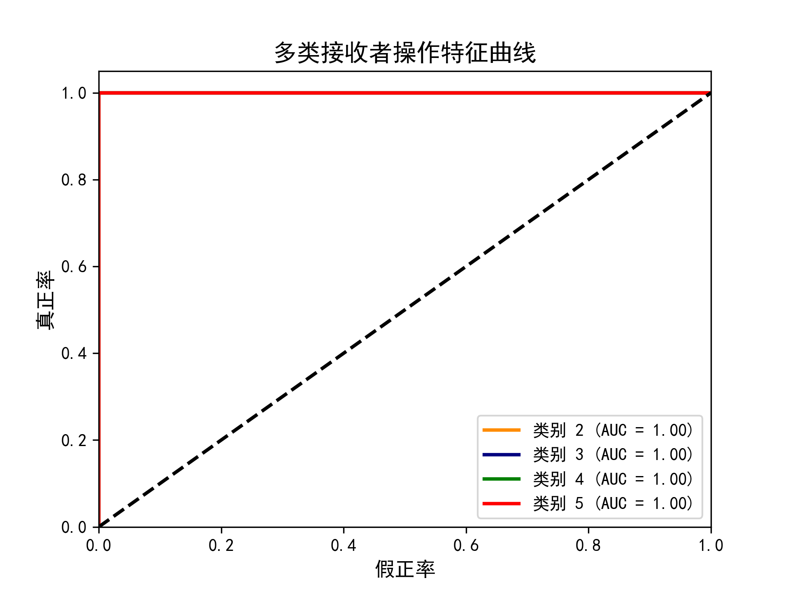
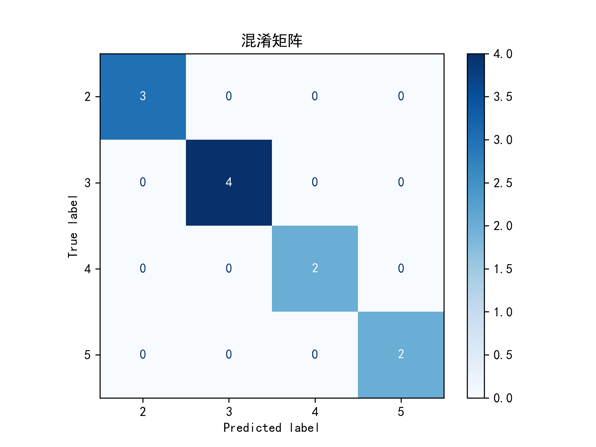
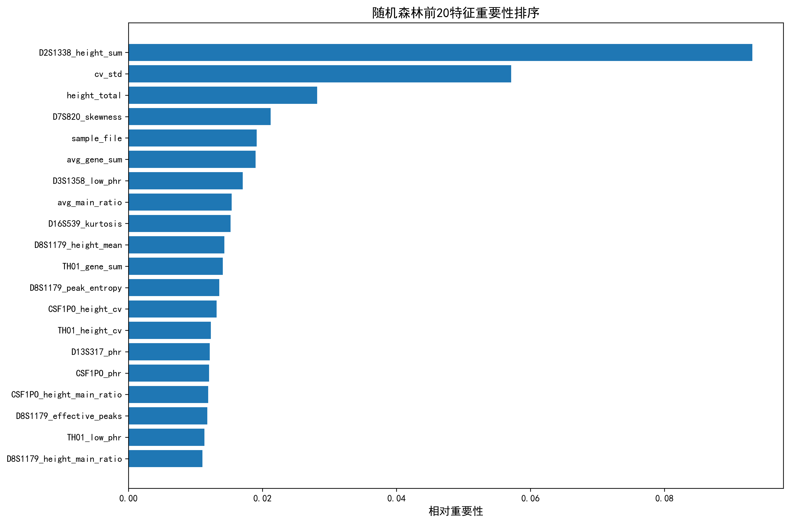
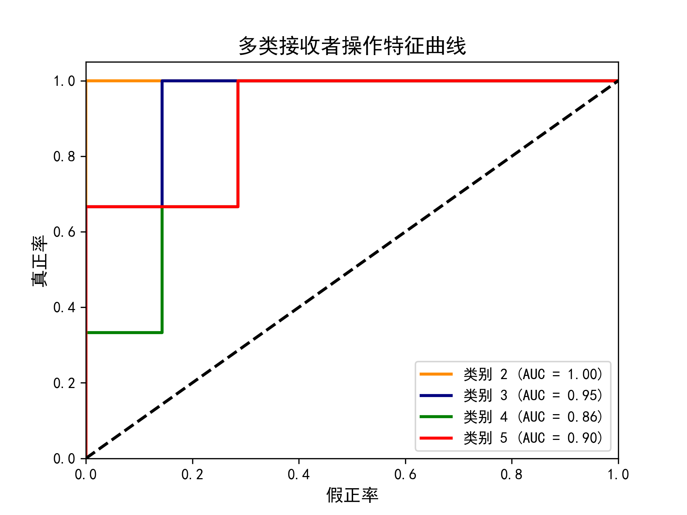
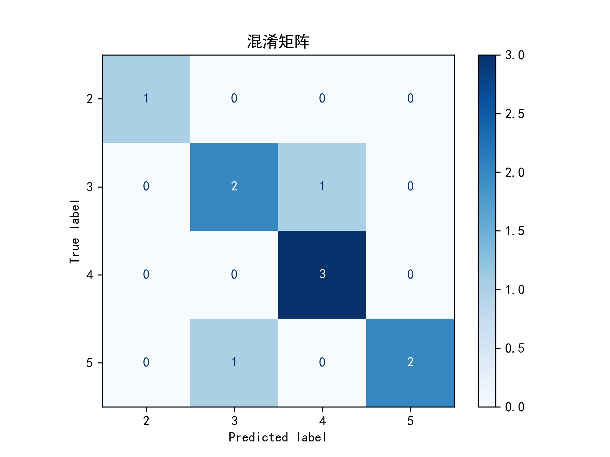

# 介绍
这是一个用于csu2025数模校赛的项目~~

队伍：渐变的金黄色宇宙队  
语言: python, R  
题目：[D题：法医物证多人身份鉴定问题.docx](论文材料/D题：法医物证多人身份鉴定问题.docx)
## 问题1
具体思路见[quesD_try.pdf](论文材料/quesD_try.pdf)
### 特征工程
1. 目标特征：
   - 混合人数
   - 混合比例
2. 每个基因座特征（*16）：
   ```R
   enhanced_char <- c("gene_sum","height_sum","height_mean","height_std","height_max",
                      "height_cv", "skewness", "kurtosis", "effective_peaks",
                      "triplet_ratio", "phr", "low_phr", "high_freq_cluster",
                      "height_main_ratio", "peak_entropy")
   ```
3. 全局特征
   ```R
   global_features <- c("sample_file","gene_from","people","proportion", "gene_total","height_total",
                        "cv_std","prop_max", "prop_min", "prop_sd", "prop_entropy",
                        "avg_gene_sum", "sd_effective_peaks", "avg_phr", "var_phr",
                        "total_low_phr", "avg_main_ratio")
   ```
4. 动态噪声过滤：结合最大峰高和总峰高
   ```R
    valid_heights <- heights[!is.na(heights)]
    if (length(valid_heights) > 0) {
      total_height <- sum(valid_heights)
      threshold <- max(0.1*max(valid_heights), 0.01*total_height)
      valid_heights <- valid_heights[valid_heights > threshold]
    }
    ```
5. 数据预处理代码:[data_preprocessing_new.R](data_preprocessing_new.R)
### 运行结果
1. 数据集：[enhanced_processed_Q1_data.xlsx](data/enhanced_processed_Q1_data.xlsx)，八二分
2. 模型：随机森林[random_forest.py](random_forest.py)
3. 交叉验证最佳分数: 0.9666666666666666
4. 最佳参数: {'max_depth': 5, 'max_features': 'sqrt', 'min_samples_leaf': 1, 'min_samples_split': 2, 'n_estimators': 200}
5. 模型评估指标：
   - 准确率: 1.0000
   - 精确率: 1.0000
   - 召回率: 1.0000
   - F1分数: 1.0000
   - AUC值: 1.0000
6. 模型性能可视化：
   
   
   

## 问题2
具体思路见[第二问建模2.pdf](论文材料/第二问建模2.pdf)
### 判断人数
数据预处理同上
1. 数据集：[enhanced_processed_Q1_data.xlsx](data/enhanced_processed_Q1_data.xlsx)
2. 模型：随机森林[random_forest_Q2.py](random_forest_Q2.py)
3. 交叉验证最佳分数: 0.5369047619047619
4. 最佳参数: {'max_depth': 5, 'max_features': 'sqrt', 'min_samples_leaf': 2, 'min_samples_split': 5, 'n_estimators': 300}
5. 模型评估指标:
   - 准确率: 0.8000
   - 精确率: 0.8542
   - 召回率: 0.8333
   - F1分数: 0.8310
   - AUC值: 0.9259
6. 模型性能可视化：
   
   
   
### 判断比例
（以2人的样本为例）
1. 设出两人的基因型为矩阵A1,A2=（a_ij)16*30,行为16个基因座，列为等位基因，a_ij={0,1,2}表示有该基因的数量。a_ij对应的具体基因已经约定。
2. 穷举a_ij,Ai=p1*A1+p2*A2，为理论混合数据（单位：基因个数）
3. 构建样本矩阵Bi=（b_ij)16*30，查找对应位置的基因对应的峰高，未查到的记为NA。为实际混合数据（单位：基因峰高）。
4. 输入矩阵Ci：对Bi按行做归一化。
5. 比较Ai与Ci
### 运行结果